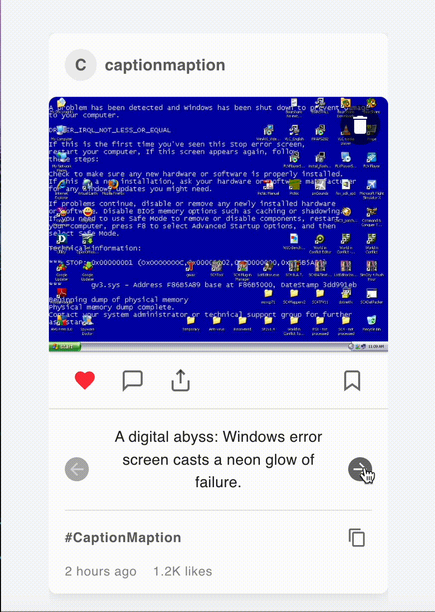

Caption generator using OpenAI API

Quick demo:

git clone https://github.com/yourusername/captionmaption.git
cd captionmaption
npm install
Enter your OpenAI API key in the .env file
npm run dev
Visit `http://localhost:3000` in your browser to see the app in action!

## Features

- **Image Upload**: Easily upload images for caption generation.
- **Creative Caption Generation**: Utilize AI to generate engaging captions based on the content of the uploaded images.
- **Responsive Design**: The app is fully responsive, ensuring a seamless experience across all devices.
- **So many features in my mind**: Adjust the tone, re-generate the caption, and more.
## License

This project is licensed under the MIT License